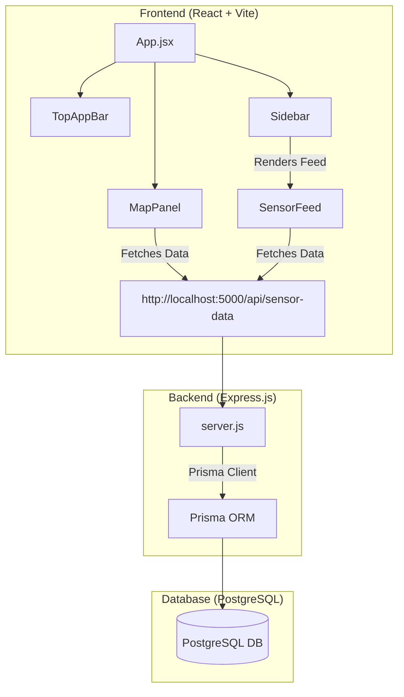

# 🚦 Smart City Traffic & Environmental Management System

A modern, real-time dashboard for monitoring urban traffic congestion and environmental air quality across smart city sectors. This project features an interactive vector-based map representation and a detailed analytics control center.

---

## 🏛️ Project Architecture

The system is built on a decoupled Client-Server architecture:



---

## 🌟 Key Features

### 🖥️ Frontend (Client Dashboard)
- **Interactive SVG Road Network Map**: Renders real-time visual overlays for streets (A, B, C, D, and E), changing indicator colors and strokes based on live traffic congestion levels.
- **Sensor Hover Tooltips**: Interacting with streets shows popup widgets reporting exact sector data, queue lengths, and carbon monoxide concentration levels.
- **Collapsible Sidebar**: A sleek panel featuring:
  - **City Overview**: Total active nodes tracking and carbon monoxide concentration indicator.
  - **Sector Summary**: Real-time traffic status (High, Mod, Low) and pollution index monitoring across North, West, Central, and South sectors.
  - **Live Sensor Feed**: List of active streets showing current queue metrics and timestamped readings.
- **Material design aesthetics**: Uses cohesive colors, blurred glassmorphic header backdrops, dark-mode styling, and smooth animations.

### ⚙️ Backend (REST API & DB Service)
- **Prisma Schema & client**: Connects seamlessly with a PostgreSQL database, storing street-level sensor events.
- **Sensor Data Schema**:
  - `id`: Auto-incrementing identifier.
  - `street`: Street label (e.g., "Street A").
  - `sector`: Urban region label (e.g., "North").
  - `queueLength`: Queue size in meters.
  - `coConcentration`: Air quality / Carbon Monoxide level.
  - `createdAt`: Auto-generated timestamp.
- **Express REST API Endpoints**:
  - `GET /` — Verification of backend status.
  - `GET /api/data` — Generic test endpoint.
  - `GET /api/sensor-data` — Retreives latest sensor readings sorted by creation time.
  - `POST /api/sensor-data` — Submits and logs fresh sensor readings from physical nodes.

---

## 🛠️ Technology Stack

| Component | Technology | Description |
| :--- | :--- | :--- |
| **Frontend** | React (v18+) | Interactive user interface library |
| **Build Tool** | Vite | Ultra-fast local development & build system |
| **Styling** | Tailwind CSS & Material Icons | Utility-first styling & clean layout icons |
| **Backend** | Express / Node.js | Fast, minimalist backend web framework |
| **Database ORM** | Prisma | Typesafe SQL database schema management and client |
| **Database** | PostgreSQL | Robust relational database for reliable storage |

---

## 🚀 Getting Started

### Prerequisites
- Node.js (v18 or higher)
- npm (Node Package Manager)
- PostgreSQL Database instance

---

### 📥 Installation & Setup

1. **Clone the Repository**
   ```bash
   git clone <repository-url>
   cd Traffic-Managment-System
   ```

2. **Configure and Launch the Backend**
   - Navigate to the backend directory:
     ```bash
     cd backend
     ```
   - Install dependencies:
     ```bash
     npm install
     ```
   - Configure your environment:
     Create a `.env` file inside the `backend` directory (make sure it isn't committed, handled by `.gitignore`):
     ```env
     DATABASE_URL="postgresql://<username>:<password>@localhost:5432/<database_name>?schema=public"
     PORT=5000
     ```
   - Set up your Database (Prisma Migrations):
     ```bash
     npx prisma migrate dev --name init
     ```
   - Start the server in development mode:
     ```bash
     npm run dev
     ```
     The server will run on `http://localhost:5000`.

3. **Configure and Launch the Frontend**
   - Navigate to the frontend directory:
     ```bash
     cd ../frontend
     ```
   - Install dependencies:
     ```bash
     npm install
     ```
   - Start the Vite development server:
     ```bash
     npm run dev
     ```
     The dashboard will run on `http://localhost:5173`.

---

## 📡 REST API Reference

### 1. Test Endpoint
* **URL**: `/api/data`
* **Method**: `GET`
* **Response**: `200 OK`
  ```json
  {
    "message": "Hello from backend"
  }
  ```

### 2. Fetch Sensor Data
* **URL**: `/api/sensor-data`
* **Method**: `GET`
* **Response**: `200 OK`
  ```json
  [
    {
      "id": 1,
      "street": "Street A",
      "sector": "Sector 1",
      "queueLength": 45,
      "coConcentration": 1.2,
      "createdAt": "2026-06-15T11:00:00.000Z"
    }
  ]
  ```

### 3. Record Sensor Data
* **URL**: `/api/sensor-data`
* **Method**: `POST`
* **Content-Type**: `application/json`
* **Payload**:
  ```json
  {
    "street": "Street B",
    "sector": "Sector 2",
    "queueLength": 30,
    "coConcentration": 0.8
  }
  ```
* **Response**: `201 Created`
  ```json
  {
    "id": 2,
    "street": "Street B",
    "sector": "Sector 2",
    "queueLength": 30,
    "coConcentration": 0.8,
    "createdAt": "2026-06-15T11:05:00.000Z"
  }
  ```
